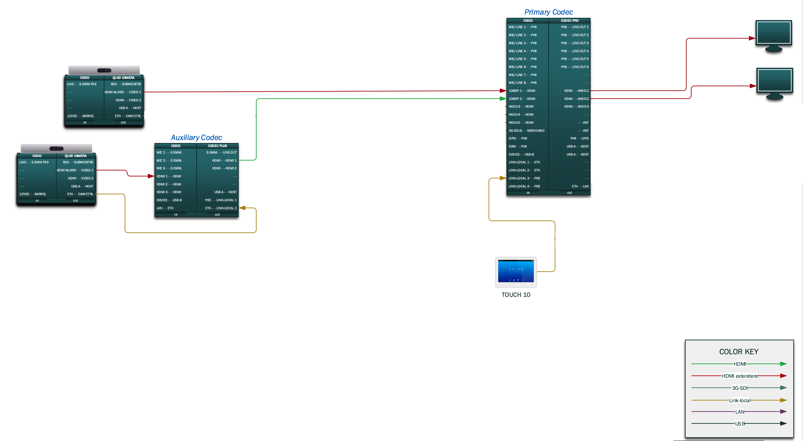
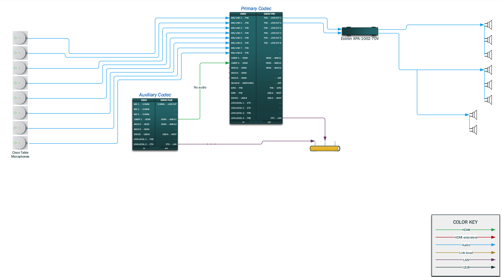
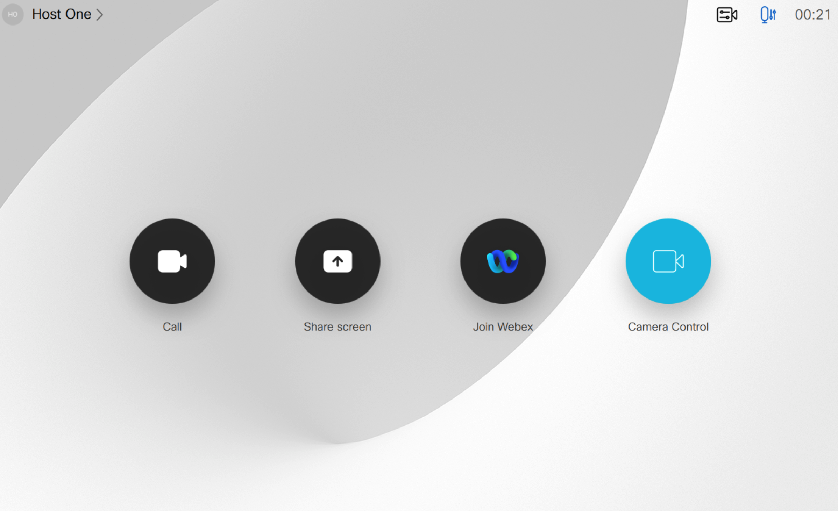
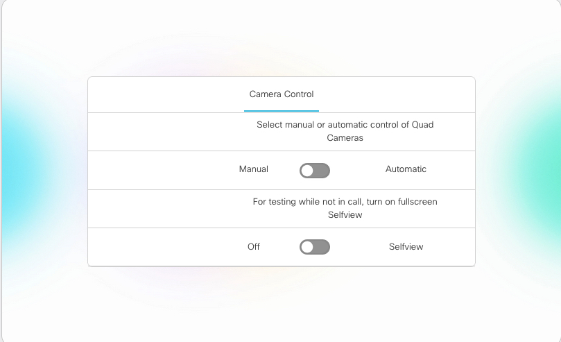

# GVE DevNet Webex Devices Executive Room QuadCam Switcher Macro
Webex Room Device macro to switch input source to QuadCam camera pointed in the direction of the area of the room that has audio activity as detected by the table microphones in the zone. 


## Contacts
* Gerardo Chaves (gchaves@cisco.com)
* Enrico Conedera (econeder@cisco.com)

## Solution Components
* Webex Collaboration Endpoints
* Javascript
* xAPI

## Installation/Configuration
This sample includes 2 macros that are installed on separate Webex Codecs to work in conjunction to cover a large executive room with 2 QuadCam cameras given the limitation that only 1 QuadCam can be connected to a codec. The first QuadCam is connected to the main codec (typically a Webex Codec Pro) and the second one to the auxiliary codec (typically a Webex Codec Plus) which in turn has it's HDMI 1 video output connected to the main codec into it's HDMI 2 input. 

This diagram shows how the codecs should be connected when it comes to the video connections. Notice that the camera input 2 on the Primary (Main) Codec comes from 
Output 1 on the Auxiliary codec since we are just using that codec to pass along the video from the QuadCam. 



And this diagram shows all the audio connections. Notice that all microphones are connected to the Primary (Main) Codec since the macro running 
there is the one making all of the decisions on which camara to activate depending on audio activity. 



After the codecs, cameras and microphones are correctly connected, do the following to configure the macros on each codec:

1) Edit your local version of 'main_codec_macro.js' and change the following:
- AUX_CODEC_IP: set to the IP address or hostname of the Aux codec 
```  
const AUX_CODEC_IP ='192.168.0.80';
```  
- AUX_CODEC_USERNAME and AUX_CODEC_PASSWORD are the username and password of a user with integrator or admin roles on the Auxiliary Codec
Here are instructions on how to configure local user accounts on Webex Devices: https://help.webex.com/en-us/jkhs20/Local-User-Administration-on-Room-and-Desk-Devices)  
```
const AUX_CODEC_USERNAME='username';
const AUX_CODEC_PASSWORD='password';
```  
- CONNECTORS: Specify the input connectors associated to the microphones being used in the room (i.e. the macro will evaluate mic input id's 1-8 for it's switching logic):  
```
const CONNECTORS = [1,2,3,4,5,6,7,8];
```  
- MAP_CAMERA_SOURCE_IDS: Associate the connectors to specific input source ID corresponding to the camera that covers where the mic is located. (i.e. mics 1,2,3 and 4 are located where Camera associated to video input 1 is pointing at):  
```
const MAP_CAMERA_SOURCE_IDS = [1,1,1,1,2,2,2,2];
```  
- overviewShowDouble: Defines what is shown to the far end (the video the main codec sends into the call or conference) when in "overview" mode where nobody is speaking or there is no prominent speaker detected by any of the microphones. The example below shows how to enable that the two inputs defined in OVERVIEW_DOUBLE_SOURCE_IDS are shown side by side. 
``` 
const overviewShowDouble = true
```  

- OVERVIEW_SINGLE_SOURCE_ID: Specify here the source video ID to use when in overview mode if you set overviewShowDouble to false (i.e. use in camera associated to video input 1):  
``` 
const OVERVIEW_SINGLE_SOURCE_ID = 1
```  
- OVERVIEW_DOUBLE_SOURCE_IDS: Specify here the source video array of two IDs to use when in overview mode if you set overviewShowDouble to true (i.e. use in camera associated to video input 2 and 1):  
``` 
const OVERVIEW_DOUBLE_SOURCE_IDS = [2,1]
```  


2) Edit your local version of 'aux_codec_macro.js' and change the following:
- MAIN_CODEC_IP: set to the IP address or hostname of the Main codec 
```  
const MAIN_CODEC_IP ='192.168.0.80';
```  
- MAIN_CODEC_USERNAME and MAIN_CODEC_PASSWORD are the username and password of a user with integrator or admin roles on the Main Codec
Here are instructions on how to configure local user accounts on Webex Devices: https://help.webex.com/en-us/jkhs20/Local-User-Administration-on-Room-and-Desk-Devices)  
```
const MAIN_CODEC_USERNAME='username';
const MAIN_CODEC_PASSWORD='password';
```  

3) Load the code contained in the 'main_codec_macro.js' into the Macro editor of the main codec and the 'aux_codec_macro.js' into the Macro editor of the auxiliary codec. 'main_codec_macro.js' contains all of the logic to choose which input to select (QuadCam1 connected directly vs QuadCam2 connected indirectly via Aux codec) as well as the logic to make sure that the Aux codec is active and receiving the input from QuadCam2. If you are unfamiliar with Cisco Room device macros and how to manage them, this is a good article to get started: 
https://help.webex.com/en-us/np8b6m6/Use-of-Macros-with-Room-and-Desk-Devices-and-Webex-Boards  
   
  
4) To be able to manually turn on and off the functionality of this macro from the Touch 10 device of the Main codec, please import the ```CameraManualOverride.xml``` file into the 
main codec using it's UI Extension Editor. Without this custom panel installed on the Main codec, you will see errors being logged by the 
   macro given that it updates the state of toggle buttons on it. If you are unfamiliar with UI Extensions and how to load them from the devices 
   web interface, visit this article: https://help.webex.com/en-us/n18glho/User-Interface-Extensions-with-Room-and-Desk-Devices-and-Webex-Boards . 
   You can find more details and screenshots also in this guide: https://www.cisco.com/c/dam/en/us/td/docs/telepresence/endpoint/roomos-103/desk-room-kit-boards-customization-guide-roomos-103.pdf
  
NOTE: The macro is written to hide the mid-call controls “Lock meeting” and “Record”.  The reason for this is so that the
 custom “Camera Control” button added above can be seen always in a call without having to press on the More.. button. 
If you prefer to have the mid-call controls always showing edit line 34 of the 'main_codec_macro.js' on the main codec that has the following config command:  
```
xapi.Config.UserInterface.Features.Call.MidCallControls.set("Hidden")
```  
and change the value in the string being sent as a parameter from “Hidden” to “Auto”


## Usage

Once the macros are loaded and activated, the correct video switching behavior should occur automatically every time a call connects.  

To manually turn on and off the Automatic switching based on microphone input across the two quad cams, you can use the panel installed on step 4 above; just press the Camera Control button on the Touch 10:




That should bring up the following Panel where you can select the behavior desired: 


  

The following actions with turn off the automatic behaviour for you in addition to manually turning it off:  
  
a) When a call disconnects  
b) Bringing the main codec out of half-wake mode  


### LICENSE

Provided under Cisco Sample Code License, for details see [LICENSE](LICENSE.md)

### CODE_OF_CONDUCT

Our code of conduct is available [here](CODE_OF_CONDUCT.md)

### CONTRIBUTING

See our contributing guidelines [here](CONTRIBUTING.md)

#### DISCLAIMER:
<b>Please note:</b> This script is meant for demo purposes only. All tools/ scripts in this repo are released for use "AS IS" without any warranties of any kind, including, but not limited to their installation, use, or performance. Any use of these scripts and tools is at your own risk. There is no guarantee that they have been through thorough testing in a comparable environment and we are not responsible for any damage or data loss incurred with their use.
You are responsible for reviewing and testing any scripts you run thoroughly before use in any non-testing environment.